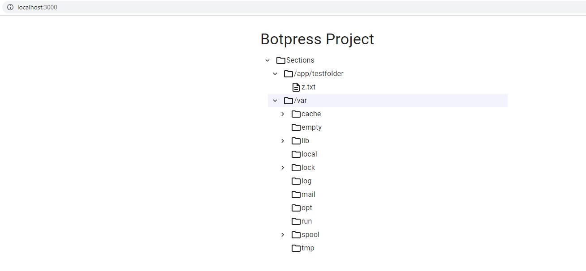

# Botpress project

See the overall picture to see the architecture for the Botpress project. 


## Components.

#### Client service. 
* A React Scripts Application that provides the code to execute on the browser. 
* Docker is used as container presenting a development image with hot reload. 
* Typescript is used as programming language.
* MUI is used as Material Design CSS Framework.

#### Watcher service.
* Node.js application.
* Websocket server that provides realtime communication with the client, using socket.io library. 
* Docker is used as container presenting a development image with hot reload also. 
* Initial requirements asked to use folders to watch by arguments, but I changed to read from watcher.txt file to gain more flexibility at the moment to use the docker images. 
* Unit tests are included to show the use of Jest. I only included a few test cases, mocking some objects, etc. It doesn't include all the possbiles scenarios to test. My target here was show the integration and configuration the test on the project. 
* A testfolder folder was included, as directory to watch. It is configured in the watcher.txt file. You can manage files/folders inside this directory, or include other paths in watcher.txt before run the project. 
* Typescript is used as programming language.

#### Nginx service.
* I used Nginx server for expose the service to the clients and for routing the communication with client and watcher services.

#### Docker Compose establishment with all services on docker.
* Containerization of microservices.

## Run The Project
You will need the following tools:

* [Docker Desktop](https://www.docker.com/products/docker-desktop)

### Installing
Follow these steps to get your development environment set up: (Before Run Start the Docker Desktop)
1. Clone the repository
2. At the root directory which include **docker-compose.yml** files, run below command:
```
docker-compose up -d
```
3. Wait for docker compose all microservices. That’s it! (some microservices need extra time to work so please wait if not worked in first shut)
4. Launch http://localhost:3000 in your browser to view the Botpress project. Make sure that every microservices are healthy.



## Run the Tests 

### Instructions
Follow these steps to run the tests. The only included tests are in watcher project.

1. Clone the repository
2. Go to the watcher folder:
```
cd watcher
```
2. Install the dependencies:
```
npm install
```
3. Run the tests:
```
npm run test
```

### That's all, folks. Thanks for your patience and happy review!!!